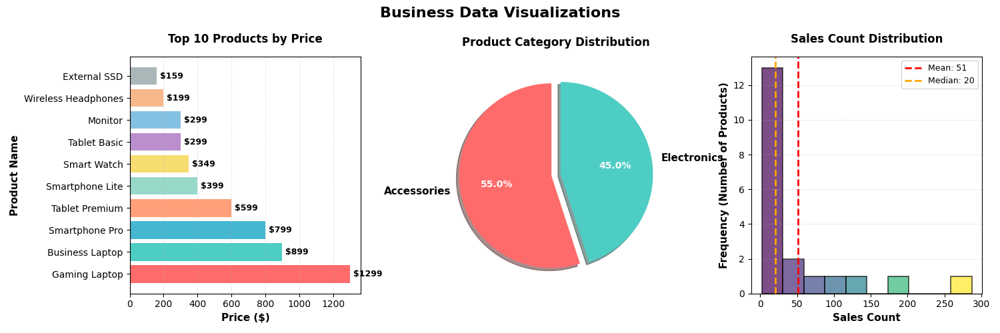
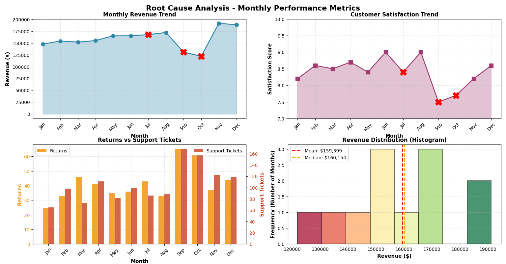

# Lab Assignment 4 - Data Analytics with Python & Pandas

This repository contains 4 lab programs demonstrating various data analytics concepts using Python, Pandas, and Matplotlib.

## 📋 Overview

- **Program 1**: Basic Data Exploration
- **Program 2**: Four Types of Data Analytics (Descriptive, Diagnostic, Predictive, Prescriptive)
- **Program 3**: Data Visualization (Bar Chart, Pie Chart, Histogram)
- **Program 4**: Root Cause Analysis

## 🚀 Quick Start

### 1. Install Dependencies

```bash
uv add pandas matplotlib numpy scikit-learn
```

### 2. Generate Synthetic Datasets

```bash
uv run generate_datasets.py
```

This will create 4 CSV files:
- `employees_data.csv` - Employee records
- `sales_data.csv` - Sales transactions
- `products_data.csv` - Product information
- `monthly_performance.csv` - Monthly business metrics

### 3. Run Individual Programs

```bash
# Program 1: Basic Data Exploration
uv run program1_data_exploration.py

# Program 2: Four Types of Analytics
uv run program2_analytics_types.py

# Program 3: Data Visualization
uv run program3_visualizations.py

# Program 4: Root Cause Analysis
uv run program4_root_cause_analysis.py
```

## 📊 Program Details

### Program 1: Basic Data Exploration
**File**: `program1_data_exploration.py`

**Expected Output**:
- ✅ Tabular dataset printed
- ✅ Summary statistics (mean, std, min, max, count, etc.)
- ✅ List of column names displayed
- ✅ Department-wise analysis
- ✅ Key insights

**Dataset**: Employee data with 25 records

---

### Program 2: Four Types of Data Analytics
**File**: `program2_analytics_types.py`

**Expected Output**:
- ✅ **Descriptive Analytics**: Average sales, total revenue, product performance
- ✅ **Diagnostic Analytics**: Correlation between sales, profit, marketing spend
- ✅ **Predictive Analytics**: Future sales predictions using Linear Regression
- ✅ **Prescriptive Analytics**: Business recommendations and action items

**Dataset**: Sales data with 36 monthly records across 3 products

---

### Program 3: Data Visualization
**File**: `program3_visualizations.py`

**Expected Output**:
- ✅ **Bar Chart**: Displaying product prices (horizontal bar chart)
- ✅ **Pie Chart**: Showing percentage distribution by category
- ✅ **Histogram**: Showing sales frequency distribution with mean/median lines

**Dataset**: Product catalog with 20 items

---

### Program 4: Root Cause Analysis
**File**: `program4_root_cause_analysis.py`

**Expected Output**:
- ✅ Performance drop identification (September & October)
- ✅ Root cause analysis using correlation metrics
- ✅ Detailed investigation of problem months
- ✅ Business recommendations
- ✅ **Visualizations**:
  - Revenue trend line chart
  - Customer satisfaction trend
  - Returns vs Support Tickets comparison
  - Revenue distribution histogram

**Dataset**: 12 months of business performance data

## 📁 File Structure

```
lab_4_assignment/
├── generate_datasets.py          # Synthetic dataset generator
├── program1_data_exploration.py  # Lab Program 1
├── program2_analytics_types.py   # Lab Program 2
├── program3_visualizations.py    # Lab Program 3
├── program4_root_cause_analysis.py # Lab Program 4
├── requirements.txt              # Python dependencies
├── README.md                     # This file
│
├── employees_data.csv            # Generated dataset
├── sales_data.csv                # Generated dataset
├── products_data.csv             # Generated dataset
└── monthly_performance.csv       # Generated dataset
```

## 🔧 Dependencies

- **pandas** >= 2.0.0 - Data manipulation and analysis
- **matplotlib** >= 3.7.0 - Data visualization
- **numpy** >= 1.24.0 - Numerical computing
- **scikit-learn** >= 1.3.0 - Machine learning (for predictions)

## 💡 Key Features

### Synthetic Dataset Generation
All datasets are generated programmatically using Python for:
- **Reproducibility**: Same datasets every time (seed=42)
- **Flexibility**: Easy to modify parameters
- **Realism**: Data includes correlations and realistic patterns

### Comprehensive Analytics
- Statistical analysis with Pandas
- Correlation analysis
- Linear regression predictions
- Business insights and recommendations

### Professional Visualizations
- Color-coded charts with gradients
- Labeled axes and titles
- Statistical markers (mean, median)
- Problem identification highlights

## 📝 Assignment Requirements Coverage

| Requirement | Program | Status |
|------------|---------|--------|
| Create sample dataset | All | ✅ |
| Display dataset | Program 1 | ✅ |
| Summary statistics | Program 1 | ✅ |
| List column names | Program 1 | ✅ |
| Descriptive Analytics | Program 2 | ✅ |
| Diagnostic Analytics | Program 2 | ✅ |
| Predictive Analytics | Program 2 | ✅ |
| Prescriptive Analytics | Program 2 | ✅ |
| Bar Chart | Program 3 | ✅ |
| Pie Chart | Program 3 | ✅ |
| Histogram | Program 3 | ✅ |
| Root Cause Analysis | Program 4 | ✅ |
| Performance Drop Identification | Program 4 | ✅ |
| Metric-based Analysis | Program 4 | ✅ |

## 🎯 Learning Outcomes

After completing these programs, you will understand:
1. Data exploration and statistical analysis with Pandas
2. The four types of analytics and their applications
3. Creating professional visualizations with Matplotlib
4. Performing root cause analysis on business data
5. Making data-driven business recommendations

## 📧 Notes

- All programs include detailed console output
- Visualizations open in separate windows
- Close visualization windows to continue program execution
- Datasets are realistic with intentional patterns for analysis

---

**Created for**: Lab Assignment 4  
**Tools**: Python, Pandas, Matplotlib, NumPy, Scikit-learn  
**Date**: November 2025

# Output

## Program 1: Basic Data Exploration
---
### LAB PROGRAM 1: BASIC DATA EXPLORATION
---

Loading employee dataset...
Dataset loaded successfully!

---
### 1. COMPLETE DATASET (Tabular Format)
---
```
Employee_ID                Name Department  Age  Salary  Experience_Years
       E001          Ryan Davis      Sales   30  107545                17
       E002          John Lopez         HR   43   59197                 9
       E003        James Taylor         HR   38   87509                14
       E004         Lisa Wilson         HR   34  106698                22
       E005         Laura Davis         HR   31   96542                 2
       E006      Michelle Lopez  Marketing   44   82087                17
       ...
       ...
       ...
```

---
### 2. SUMMARY STATISTICS
---
```
              Age         Salary  Experience_Years
count  250.000000     250.000000        250.000000
mean    36.328000   86369.048000         12.096000
std      7.840556   16856.639603          6.135582
min     24.000000   54368.000000          2.000000
25%     30.000000   72596.750000          6.000000
50%     36.000000   85468.500000         13.000000
75%     43.750000  100626.750000         17.000000
max     49.000000  121726.000000         22.000000
```

---
### 3. ADDITIONAL DATASET INFORMATION
---
Total number of records: 250
Total number of columns: 6

Data types:
```
Employee_ID         object
Name                object
Department          object
Age                  int64
Salary               int64
Experience_Years     int64
dtype: object
```

---
### 4. DEPARTMENT-WISE ANALYSIS
---
```
            Avg Salary  Min Salary  Max Salary  Avg Age  Avg Experience  Employee Count
Department
Finance       86434.54       55051      118940    37.08           10.90              48
HR            86834.21       57237      119689    36.40           11.89              53
IT            85940.24       58784      117843    37.27           13.44              41
Marketing     86230.97       54368      121726    36.45           12.20              64
Sales         86337.70       60735      115936    34.36           12.25              44
```

---
### 5. COLUMN NAMES
---
Total Columns: 6

1. Employee_ID
2. Name
3. Department
4. Age
5. Salary
6. Experience_Years

---
### 6. KEY INSIGHTS
---
* Average Salary: $86,369.05
* Average Age: 36.3 years
* Average Experience: 12.1 years
* Highest Salary: $121,726
* Lowest Salary: $54,368
* Most common department: Marketing

---
✓ Data Exploration Complete!
---

## Program 2: Four Types of Data Analytics

---
### LAB PROGRAM 2: FOUR TYPES OF DATA ANALYTICS
---

Loading sales dataset...
Dataset loaded successfully!

---
### SAMPLE DATA (First 10 rows)
---
```
Month Product  Sales  Profit  Marketing_Spend  Customer_Count
  Jan  Laptop  32493    9747             3249             164
  Jan   Phone  25852    7755             2585             147
  Jan  Tablet  25897    7769             2589             110
  Feb  Laptop  37859   11357             3785             167
  Feb   Phone  27487    8246             2748             110
  ....
```

---
### 1. DESCRIPTIVE ANALYTICS - What Happened?
---
* Total Sales: $1,688,456
* Average Sales: $46,901.56
* Total Profit: $506,522
* Average Profit: $14,070.06

Product-wise Performance:
```
         Total Sales  Avg Sales  Total Profit  Total Customers
Product
Laptop        573302   47775.17        171986             3026
Phone         571147   47595.58        171340             2671
Tablet        544007   45333.92        163196             2733
```

Monthly Sales Trend:
```
Month
Apr    152459
Aug    187066
Dec    138516
...
Nov    195156
Oct    152819
Sep    151105
Name: Sales, dtype: int64
```

---
### 2. DIAGNOSTIC ANALYTICS - Why Did It Happen?
---
Correlation Analysis:
```
                 Sales  Profit  Marketing_Spend  Customer_Count
Sales            1.000   1.000            1.000           0.889
Profit           1.000   1.000            1.000           0.889
Marketing_Spend  1.000   1.000            1.000           0.889
Customer_Count   0.889   0.889            0.889           1.000
```

Key Correlation Findings:
* Sales vs Profit correlation: 1.000
  → Strong positive relationship
* Sales vs Marketing Spend correlation: 1.000
  → Marketing spend significantly impacts sales
* Sales vs Customer Count correlation: 0.889
  → More customers strongly correlate with higher sales

---
### 3. PREDICTIVE ANALYTICS - What Will Happen?
---
Model R² Score: 1.000
Model Accuracy: 100.0%

Sales Forecast for Next 3 Months:
* January (Next): $147,743
* February (Next): $147,744
* March (Next): $147,745

---
### 4. PRESCRIPTIVE ANALYTICS - What Should We Do?
---
Business Recommendations Based on Analysis:

1. FOCUS ON TOP PERFORMER
   * Laptop generates highest profit ($171,986)
   * ACTION: Increase inventory and marketing for Laptop

2. MARKETING OPTIMIZATION
   * Current Marketing ROI: 900.1%
   * ACTION: Marketing is performing well, maintain current strategy

3. SEASONAL STRATEGY
   * Best performing month: Nov
   * Weakest month: Jan
   * ACTION: Plan promotions and stock accordingly

4. CUSTOMER ACQUISITION
   * Average revenue per customer: $200.29
   * ACTION: Invest in customer acquisition if cost < $60.09
   * ACTION: Implement loyalty programs to increase repeat purchases

5. GROWTH STRATEGY
   * Predicted sales show upward trend
   * ACTION: Scale operations to meet forecasted demand
   * ACTION: Hire additional staff for peak months

---
✓ Analytics Complete!
---

## Program 3: Data Visualization



---
### LAB PROGRAM 3: DATA VISUALIZATION
---

Loading products dataset...
Dataset loaded successfully!

Sample Data:
```
       Product_Name  Price    Category  Sales_Count
      Gaming Laptop   1299 Electronics            2
    Business Laptop    899 Electronics            3
     Smartphone Pro    799 Electronics            3
    Smartphone Lite    399 Electronics            7
     Tablet Premium    599 Electronics            4
       Tablet Basic    299 Electronics           10
Wireless Headphones    199 Accessories           14
  Bluetooth Speaker    149 Accessories           20
        Smart Watch    349 Electronics            8
    Fitness Tracker    129 Electronics           25
```

Creating visualizations...
1. Bar Chart - Product Prices
2. Pie Chart - Category Distribution
3. Histogram - Sales Frequency Distribution

✓ All visualizations created successfully!

Closing the plot window will continue the program...

---
### STATISTICAL SUMMARY
---

Price Statistics:
* Average Price: $296.35
* Median Price: $154.00
* Price Range: $12 - $1299

Category Distribution:
* Accessories: 11 products (55.0%)
* Electronics: 9 products (45.0%)

Sales Count Statistics:
* Average Sales Count: 51 units
* Median Sales Count: 20 units
* Total Units Sold: 1,023 units
* Best Seller: USB Cable (287 units)

---
✓ Visualization Program Complete!
---

## Program 4: Root Cause Analysis



---
### LAB PROGRAM 4: ROOT CAUSE ANALYSIS
---

Loading monthly performance dataset...
Dataset loaded successfully!

---
### MONTHLY PERFORMANCE DATA
---
```
    Month  Revenue  Customer_Satisfaction  Marketing_Budget  Returns  Support_Tickets
  January   147714                    8.2             17725       25               65
 February   154266                    8.6             18511       33               98
 ...        
 ...
  October   121996                    7.7             14639       61              158
 November   191244                    8.2             22949       37              122
 December   189062                    8.6             22687       44              119
```

---
### 1. PERFORMANCE DROP IDENTIFICATION
---

Revenue Changes (Month-over-Month):
* February: +4.4% 📈 GROWTH
* March: -1.5% 📉 DROP
* April: +2.1% 📈 GROWTH
* May: +6.5% 📈 GROWTH
* June: +0.1% 📈 GROWTH
* July: +1.4% 📈 GROWTH
* August: +2.7% 📈 GROWTH
* September: -24.1% 📉 DROP
* October: -6.7% 📉 DROP
* November: +56.8% 📈 GROWTH
* December: -1.1% 📉 DROP

Customer Satisfaction Changes:
* February: +0.4 points 📈 IMPROVEMENT
* March: -0.1 points 📉 DROP
* April: +0.2 points 📈 IMPROVEMENT
* May: -0.3 points 📉 DROP
* June: +0.6 points 📈 IMPROVEMENT
* July: -0.6 points 📉 DROP
* August: +0.6 points 📈 IMPROVEMENT
* September: -1.5 points 📉 DROP
* October: +0.2 points 📈 IMPROVEMENT
* November: +0.5 points 📈 IMPROVEMENT
* December: +0.4 points 📈 IMPROVEMENT

⚠️ MONTHS WITH SIGNIFICANT PERFORMANCE DROPS:
* July
* September
* October

---
### 2. ROOT CAUSE ANALYSIS
---

Correlation Analysis:
```
                       Revenue  Customer_Satisfaction  Marketing_Budget  Returns  Support_Tickets
Revenue                  1.000                  0.603             1.000   -0.548           -0.368
Customer_Satisfaction    0.603                  1.000             0.603   -0.689           -0.644
Marketing_Budget         1.000                  0.603             1.000   -0.548           -0.368
Returns                 -0.548                 -0.689            -0.548    1.000            0.824
Support_Tickets         -0.368                 -0.644            -0.368    0.824            1.000